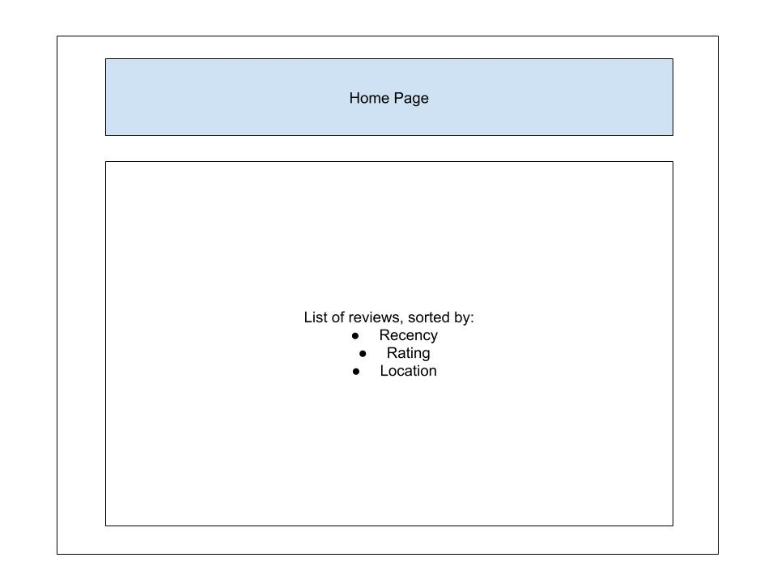
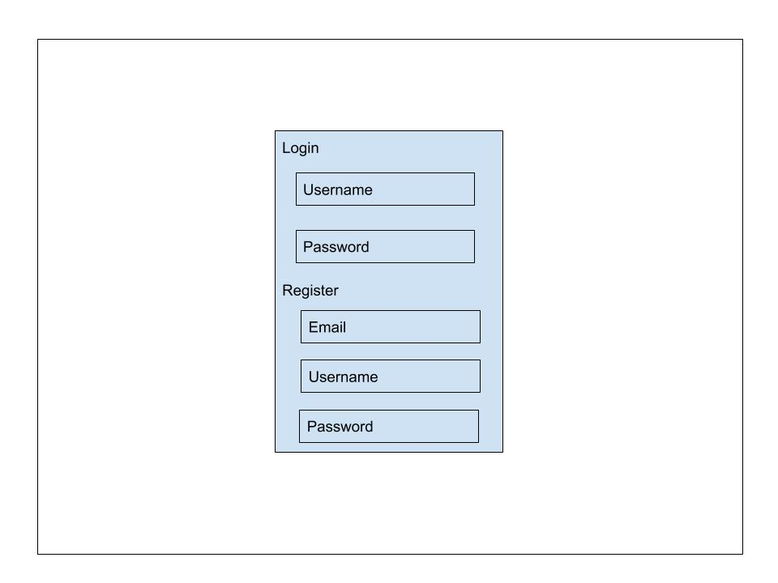
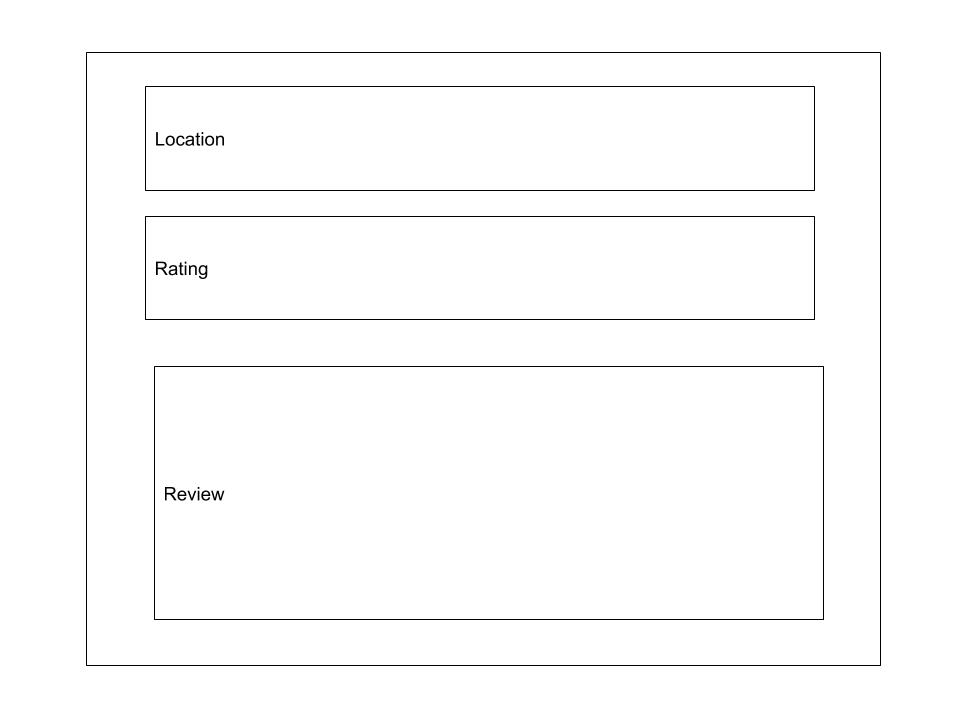
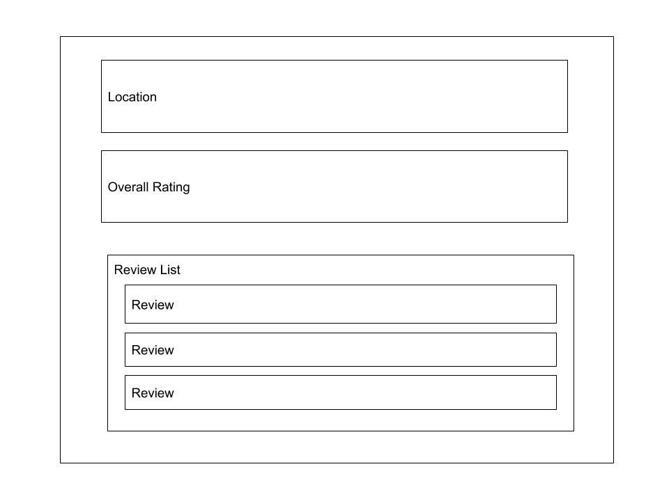
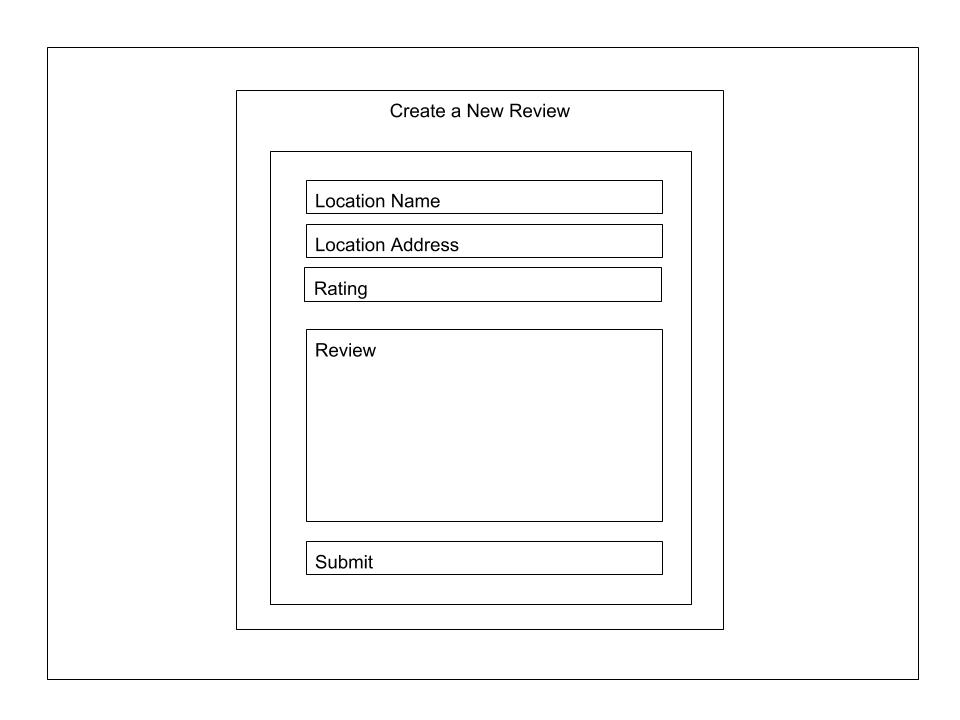
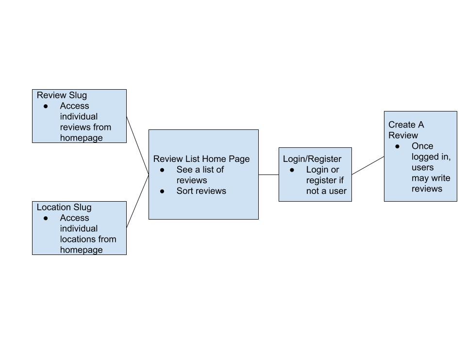

# Judy Beans 

## Overview

For most New Yorkers, a good cup of coffee is the cornerstone of any morning routine; almost nobody forgoes their morning java. The city boasts some of the best coffee shops in the world, however it is also flooded with some not so great establishments, which makes finding that small corner espresso gem incredibly tedious. That's why I've come up with Judy Beans.

Judy Beans is a review site for New York coffee lovers by New York coffee lovers. Users of the site can search for coffee shops all over New York City that have been recommended by other avid coffee drinkers. Users that sign up can spread the word about their favorite places around the city and provide additional information and praise for other places the community has recommended. If a user wants to visit a shop that they read about in a review, they can find the location and address of the shop right there in that review.


## Data Model

The application will store Users, Reviews, and Locations 

* users have access to creating and editing reviews 
* locations have an address, a name, and a list of reviews
* reviews have a text body, a rating, a reference to a location, and a reference to a user


An Example User:

```javascript
{
  username: "theCoffeeLover",
  email: Coffee@beans.com,
  hash: // a password hash
}
```

An Example Location with Embedded Reviews:

```javascript
{
  address: 123 my street,
  name: "Coffe Place",
  reviews: [Review]
}
```

An Example Review with an Embedded Location and User:

```javascript
{
  location: Coffee Place,
  user: // a reference to a user,
  rating: 5,
  review: "this place is great!"
}
```

## [Link to Commented First Draft Schema](src/db.js) 

## Wireframes

/ - the home page that shows a list of reviews that can be sorted 



/login - users may login or register here



/review/slug - an idividual review



/location/slug - an individual location with a series of reviews



/create - users who have logged in may create new reviews



## Site map



## User Stories or Use Cases


1. as a non-registered user, I can see reviews and locations on the site
2. as a non-registered user, I can sign up
3. as a user, I can log in to the site
4. as a user, I can create a new review for a new location
5. as a user, I can view all of the reviews I have made 
6. as a user, I can add reviews to existing locations

## Research Topics


* (2 points) User authentication
    * Use bcrypt for user authentication
* (2 points) Perform client side form validation using jQuery
    * Making sure user input is both safe and correct
    * Many resources for jQuery, so not too difficult and is not worth many points
* (3 points) Google Maps API
    * Use Google Maps JavaScript API to implement some directional functionality and address validation
    * Contain the scope of the project to NYC through address checking
    * Novel, but with many resources, I have assigned it 3 points
* (4 points) react.js
    * Use react.js for client side rendering 
    * create reusable layouts and better design
    * Novel and somewhat difficult, I have assigned it 4 points

11 points total out of 8 required points 


## [Link to Initial Main Project File](src/app.js) 

## Annotations / References Used

1. [bcrypt.js authentication](https://www.npmjs.com/package/bcrypt)
2. [tutorial on React.js](https://reactjs.org/docs/hello-world.html)
3. [tutorial on Google Maps API (may vary depending on API research)](https://developers.google.com/maps/documentation/javascript/places)\
